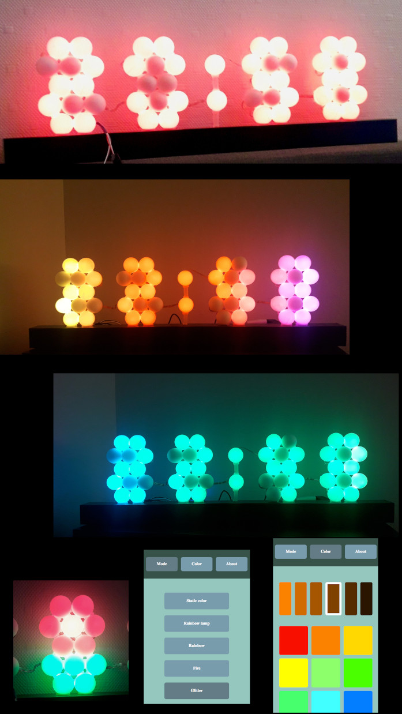

# ClockPanel
Copyright (C) 2020 Christux

## Summary

Firmware of RGB clock panel (see below).

## Installation

The libs you will need to install on the ArduinoIDE are : 
<a href="https://github.com/Christux/ChristuxUtils">https://github.com/Christux/ChristuxUtils</a> 
<a href="https://github.com/Christux/ChristuxAnimation">https://github.com/Christux/ChristuxAnimation</a>

## Screenshots

  

## Links

<a href="https://www.arduino.cc">https://www.arduino.cc/</a> 
<a href="https://github.com/esp8266/Arduino">https://github.com/esp8266/Arduino</a> 
<a href="https://github.com/bblanchon/ArduinoJson">https://github.com/bblanchon/ArduinoJson</a> 
<a href="https://github.com/Makuna/NeoPixelBus">https://github.com/Makuna/NeoPixelBus</a>
<a href="https://github.com/PaulStoffregen/Time">https://github.com/PaulStoffregen/Time</a>
<a href="https://github.com/tzapu/WiFiManager">https://github.com/tzapu/WiFiManager</a>

## Keywords

Arduino IDE, NodeMCU, ESP8266, ESP8266WiFi, ESP8266WebServer, ESP8266mDNS, NeoPixelBus, NTP, TimeLib, ChristuxUtils, ChristuxAnimation, ArduinoJson, WiFiManager, JavaScript